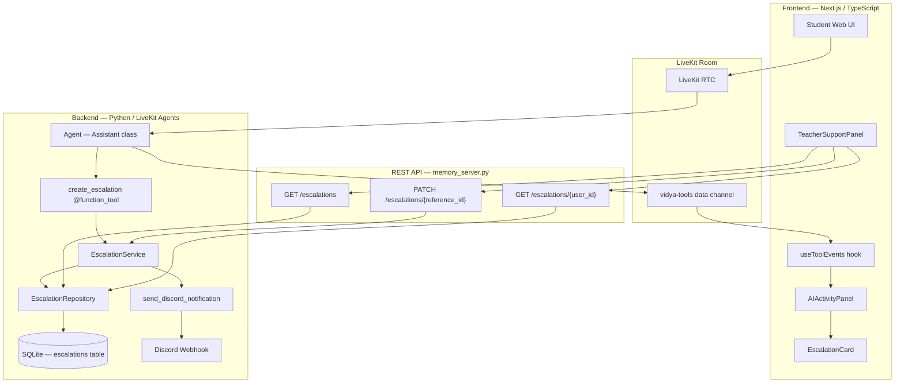
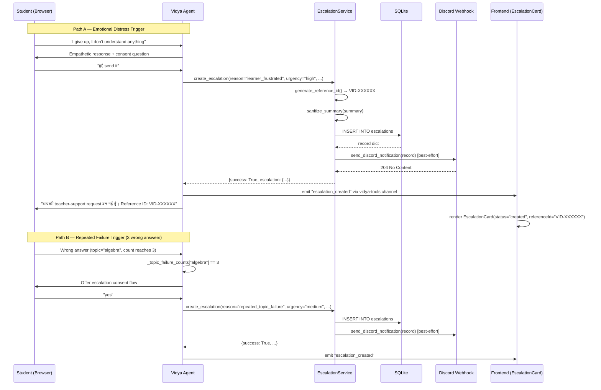

# Design Document — vidya-day7-escalation

## Overview

Day 7 adds a **Human Escalation** subsystem to Vidya. When a learner is emotionally
distressed or fails the same topic three times in a single session, Vidya pauses and
offers — with explicit consent — to create a **Teacher Support Request** (escalation).
The request is persisted in SQLite, assigned a unique `VID-XXXXXX` reference ID, and
forwarded to a Discord channel via a webhook so a human teacher is notified in
near-real-time.

All Day 1–6 features (memory, exercises, outbound SIP calls, activity panel, frontend
UI) continue to work unchanged. Day 7 is additive only.

### Implementation Status Summary

| Component | Status |
|---|---|
| `escalation_service` core functions | ✅ Implemented |
| `escalation_repository` (all CRUD) | ✅ Implemented |
| `escalations` table in SQLite | ✅ Implemented |
| `create_escalation` `@function_tool` in `agent.py` | ✅ Implemented |
| `_emit_tool_event()` in `agent.py` | ✅ Implemented |
| `GET /escalations`, `GET /escalations/{user_id}` | ✅ Implemented |
| `POST /escalations` (create + status update via POST body) | ✅ Implemented |
| `EscalationCard` component | ✅ Implemented |
| `TeacherSupportPanel` component | ✅ Implemented |
| `useToolEvents` hook (handles all escalation events) | ✅ Implemented |
| `test_escalation.py` (8 of 10 tests) | ✅ Implemented |
| `send_discord_notification()` | ❌ Not yet implemented |
| `_topic_failure_counts` counter in `Assistant` | ❌ Not yet implemented |
| `PATCH /escalations/{reference_id}` as proper REST method | ⚠️ Partial — routes through `do_POST` |
| Inline `EscalationCard` in `ai-activity-panel.tsx` | ❌ Not yet implemented |
| Discord tests (Req 12.4 and 12.5) | ❌ Not yet implemented |
| `DISCORD_WEBHOOK_URL` in `backend/.env.example` | ❌ Not yet documented |

---

## Architecture

### Component Map



### Data Flow — Two Trigger Paths



---

## Components and Interfaces

### 1. `send_discord_notification(record: dict) -> bool` — NOT YET IMPLEMENTED

**Location:** `backend/src/services/escalation_service.py`

**Purpose:** Send a formatted Discord embed notification after an escalation is
committed to SQLite. Called by `create_escalation()` after the DB write succeeds.
Best-effort — a failure here does not roll back the SQLite record.

**Interface:**

```python
def send_discord_notification(record: dict) -> bool:
    """
    Send a Discord embed notification for a new teacher support request.

    Args:
        record: The full escalation record dict as returned by
                escalation_repository.create_escalation_record().

    Returns:
        True if Discord accepted the request (2xx response).
        False if DISCORD_WEBHOOK_URL is unset, the HTTP call fails,
              or any exception is raised.

    Never raises. All failures are logged and swallowed.
    """
```

**Implementation notes:**

- Read `DISCORD_WEBHOOK_URL` from `os.getenv("DISCORD_WEBHOOK_URL", "")`. If absent
  or empty, log a warning and return `False` immediately.
- Build the payload using `json.dumps()` encoding to `bytes`, then open a
  `urllib.request.Request` with `method="POST"` and `Content-Type: application/json`.
- Wrap the `urllib.request.urlopen()` call in a `try/except Exception` block; log any
  error and return `False`.
- Check `response.status` — if not in the 200–299 range, log the status code and
  return `False`.
- No new dependencies — `urllib.request` is stdlib.

**Urgency → color mapping:**

| urgency | Discord color int |
|---|---|
| `high` | `16711680` (red `#FF0000`) |
| `medium` | `15105570` (orange `#E67E22`) |
| `low` | `3066993` (green `#2ECC71`) |

**Discord payload shape:**

```json
{
  "embeds": [{
    "title": "🆘 Teacher Support Request — VID-XXXXXX",
    "color": 15105570,
    "fields": [
      {"name": "Student",        "value": "Rahul",                "inline": true},
      {"name": "User ID",        "value": "user-abc",             "inline": true},
      {"name": "Reason",         "value": "repeated_topic_failure","inline": true},
      {"name": "Summary",        "value": "...",                   "inline": false},
      {"name": "What Was Tried", "value": "...",                   "inline": false},
      {"name": "Urgency",        "value": "medium",               "inline": true},
      {"name": "Language",       "value": "Hindi-English",        "inline": true},
      {"name": "Status",         "value": "open",                 "inline": true},
      {"name": "Created",        "value": "<ISO 8601 UTC>",       "inline": false}
    ],
    "footer": {"text": "Vidya AI Learning Assistant — Day 7"}
  }]
}
```

**Integration point in `create_escalation()`** (after the existing `create_escalation_record()` call):

```python
created_record = escalation_repository.create_escalation_record(record)
# Discord notification is best-effort: failure does not affect the response
send_discord_notification(created_record)
return {"success": True, "escalation": created_record}
```

---

### 2. `_topic_failure_counts` counter in `Assistant` — NOT YET IMPLEMENTED

**Location:** `backend/src/agent.py`, `Assistant.__init__` and `score_answer`

**Purpose:** Track per-topic wrong-answer counts within a single LiveKit session so
Vidya can offer human escalation after 3 failures on the same topic.

**Changes required:**

In `Assistant.__init__`:

```python
# Add after the existing _current_exercise line:
self._topic_failure_counts: dict[str, int] = {}
```

In `Assistant.score_answer`, after the `answer_scored` emit (inside the
`result.get("success")` branch):

```python
topic_key = result.get("topic", "")
score_result = result.get("result", "")

if score_result == "incorrect" and topic_key:
    self._topic_failure_counts[topic_key] = (
        self._topic_failure_counts.get(topic_key, 0) + 1
    )
    logger.info(
        "Failure count for topic=%r user_id=%r count=%d",
        topic_key,
        self._user_id,
        self._topic_failure_counts[topic_key],
    )
elif score_result == "correct" and topic_key:
    self._topic_failure_counts[topic_key] = 0
```

The LLM reads the failure count indirectly: `score_answer` returns a JSON dict that
includes the `result` field. The system prompt already instructs Vidya to offer
escalation when the learner struggles repeatedly. To make the count visible to the
LLM, the `score_answer` tool should include it in the returned JSON when the threshold
is met:

```python
# Add to the returned JSON dict when count reaches 3:
if self._topic_failure_counts.get(topic_key, 0) >= 3:
    returned_dict["escalation_suggested"] = True
    returned_dict["failure_count"] = self._topic_failure_counts[topic_key]
```

This lets the LLM decide to offer escalation based on structured data rather than
counting turns itself, which is more reliable.

---

### 3. `PATCH /escalations/{reference_id}` — PARTIAL (needs clean REST method)

**Location:** `backend/src/api/memory_server.py`

**Current state:** `do_PATCH` exists but delegates to `do_POST`, which handles PATCH
bodies mixed with POST create logic. The path-parsing in `do_POST` for PATCH is
fragile when `reference_id` appears in the URL rather than the body.

**Required change:** In `do_PATCH`, extract the `reference_id` from the URL path
directly and the `status` from the request body, bypassing `do_POST` entirely.

```python
def do_PATCH(self) -> None:
    """PATCH /escalations/{reference_id} — update escalation status."""
    # Extract reference_id from URL path: /escalations/{reference_id}
    path = self.path.split("?")[0].strip("/")
    parts = path.split("/")
    # Expect: ["escalations", "<reference_id>"]
    if len(parts) != 2 or parts[0] != "escalations":
        self._send_json(404, {"error": "not_found"})
        return

    ref_id = parts[1]
    if not ref_id:
        self._send_json(400, {"error": "missing_reference_id"})
        return

    content_length = int(self.headers.get("Content-Length", 0))
    body_bytes = self.rfile.read(content_length) if content_length > 0 else b""
    try:
        body = json.loads(body_bytes.decode("utf-8")) if body_bytes else {}
    except (ValueError, UnicodeDecodeError):
        self._send_json(400, {"error": "invalid_json"})
        return

    new_status = body.get("status")
    if not new_status:
        self._send_json(400, {"error": "status_required"})
        return

    # Check record exists first
    existing = escalation_service.get_escalation(ref_id)
    if existing is None:
        self._send_json(404, {"error": "not_found"})
        return

    res = escalation_service.update_status(ref_id, new_status)
    if res.get("success"):
        self._send_json(200, res)
    elif "invalid" in res.get("error", "").lower():
        self._send_json(400, {"error": "invalid_status"})
    else:
        self._send_json(500, {"error": res.get("error", "update_failed")})
```

`TeacherSupportPanel.handleUpdateStatus` also needs to be updated from `POST
/escalations` to `PATCH /escalations/{refId}` once the endpoint is clean.

---

### 4. Inline `EscalationCard` in `ai-activity-panel.tsx` — NOT YET IMPLEMENTED

**Location:** `frontend/components/app/ai-activity-panel.tsx`

**Current state:** The `toolEventToItem` function converts all tool events into flat
`ActivityItem` objects (text rows). `escalation_created` and `escalation_failed` events
are not handled — they fall through to generic `label` text.

**Required change:** Introduce a parallel `escalationCards` state alongside `items`.
When `escalation_created` or `escalation_failed` events arrive, push an
`EscalationCardProps` object rather than a flat text item.

**Key design decision:** Keep EscalationCard renders separate from the text feed.
Display escalation cards above the text item list with `AnimatePresence` for
enter/exit transitions.

```typescript
// Add to AIActivityPanel state:
const [escalationCards, setEscalationCards] = useState<
  Array<EscalationCardProps & { id: string }>
>([]);

// In the toolEvents useEffect, before converting to ActivityItem:
for (const event of newEvents) {
  if (event.type === 'escalation_created') {
    setEscalationCards((prev) => [
      {
        id: makeId(),
        status: 'created',
        referenceId: event.reference_id,
        reason: event.reason,
        summary: event.summary,
        urgency: event.urgency ?? 'medium',
        language: event.language,
      },
      ...prev,
    ]);
    continue; // don't also add a text item
  }
  if (event.type === 'escalation_failed') {
    setEscalationCards((prev) => [
      {
        id: makeId(),
        status: 'failed',
        error: event.error ?? 'Teacher support request could not be created. Please try again.',
      },
      ...prev,
    ]);
    continue;
  }
  if (event.type === 'escalation_consent_requested') {
    setEscalationCards((prev) => [
      { id: makeId(), status: 'preparing' },
      ...prev,
    ]);
    continue;
  }
  // existing: push to text items
  newItems.push(toolEventToItem(event));
}
```

In the JSX, render escalation cards above the text feed:

```tsx
{escalationCards.length > 0 && (
  <AnimatePresence>
    {escalationCards.map((card) => (
      <EscalationCard key={card.id} {...card} className="mb-2" />
    ))}
  </AnimatePresence>
)}
```

---

### 5. Discord Tests in `test_escalation.py` — NOT YET IMPLEMENTED

Two new test functions are required (Req 12.4 and 12.5):

```python
def test_discord_notification_skipped_when_no_webhook(monkeypatch):
    """Req 12.4: send_discord_notification returns False when DISCORD_WEBHOOK_URL unset."""
    monkeypatch.delenv("DISCORD_WEBHOOK_URL", raising=False)
    result = escalation_service.send_discord_notification({
        "reference_id": "VID-TEST01",
        "user_id": "test-user",
        "name": "Test",
        "reason": "test",
        "summary": "test summary",
        "what_was_checked": "",
        "urgency": "medium",
        "language": "Hindi-English",
        "status": "open",
        "created_at": "2025-01-01T00:00:00+00:00",
    })
    assert result is False


def test_discord_notification_payload_structure(monkeypatch):
    """Req 12.5: send_discord_notification builds a correctly structured embed payload."""
    captured = {}

    def mock_urlopen(req):
        import io, json as _json
        captured["payload"] = _json.loads(req.data.decode("utf-8"))
        # Simulate a 204 No Content response from Discord
        mock_resp = io.BytesIO(b"")
        mock_resp.status = 204
        mock_resp.read = lambda: b""
        return mock_resp

    monkeypatch.setenv("DISCORD_WEBHOOK_URL", "https://discord.com/api/webhooks/fake")
    monkeypatch.setattr("urllib.request.urlopen", mock_urlopen)

    record = {
        "reference_id": "VID-ABCDEF",
        "user_id": "test-user",
        "name": "Rahul",
        "reason": "learner_frustrated",
        "summary": "Learner frustrated with algebra.",
        "what_was_checked": "Linear equations",
        "urgency": "high",
        "language": "Hindi-English",
        "status": "open",
        "created_at": "2025-01-01T00:00:00+00:00",
    }
    escalation_service.send_discord_notification(record)

    assert "embeds" in captured["payload"]
    embed = captured["payload"]["embeds"][0]
    assert "VID-ABCDEF" in embed["title"]
    field_names = [f["name"] for f in embed["fields"]]
    for required in ["Student", "User ID", "Reason", "Summary", "Urgency", "Status", "Created"]:
        assert required in field_names
    assert embed["footer"]["text"] == "Vidya AI Learning Assistant — Day 7"
    assert embed["color"] == 16711680  # high urgency → red
```

---

### 6. `DISCORD_WEBHOOK_URL` in `backend/.env.example` — NOT YET IMPLEMENTED

Add the following block to `backend/.env.example`:

```bash
# Day 7 — Human Escalation / Discord Notifications
# ─────────────────────────────────────────────────
# When set, Vidya will POST a formatted embed to this Discord channel
# whenever a Teacher Support Request is created.
#
# How to get a webhook URL:
#   1. Open your Discord server → Channel Settings → Integrations → Webhooks
#   2. Click "New Webhook", choose a channel, copy the Webhook URL.
#   3. Paste it here.
#
# Leave blank (or remove) to disable Discord notifications entirely.
# The backend starts and all other features work without this variable.
DISCORD_WEBHOOK_URL=
```

---

## Data Models

### `escalations` Table (already exists in SQLite)

```sql
CREATE TABLE IF NOT EXISTS escalations (
    reference_id      TEXT PRIMARY KEY,        -- e.g. "VID-7A42K9"
    user_id           TEXT NOT NULL,            -- LiveKit participant identity
    name              TEXT,                     -- learner's display name, if known
    reason            TEXT NOT NULL,            -- "learner_frustrated" | "repeated_topic_failure" | "explicit_teacher_request" | "concept_too_difficult"
    summary           TEXT NOT NULL,            -- sanitized agent-generated summary
    what_was_checked  TEXT,                     -- sanitized description of prior attempts
    urgency           TEXT DEFAULT 'medium',    -- "low" | "medium" | "high"
    language          TEXT,                     -- "Hindi-English" | "Hindi" | "English"
    follow_up_method  TEXT,                     -- "teacher_callback" | "app_dashboard" | "phone"
    status            TEXT DEFAULT 'open',      -- "open" | "in_progress" | "resolved"
    created_at        TEXT NOT NULL,            -- ISO 8601 UTC timestamp
    FOREIGN KEY(user_id) REFERENCES users(user_id) ON DELETE CASCADE
);

CREATE INDEX IF NOT EXISTS idx_escalations_user   ON escalations(user_id);
CREATE INDEX IF NOT EXISTS idx_escalations_status ON escalations(status);
```

**Notes:**
- `reference_id` is generated by `generate_reference_id()` — never auto-incremented.
- `summary` and `what_was_checked` are always stored post-`sanitize_summary()`.
- Cascade delete: deleting a `users` row removes all their escalations.
- `init_db()` is idempotent — safe to call on every server start.

### `ToolEvent` (TypeScript — `useToolEvents.ts`)

Escalation-relevant fields on the `ToolEvent` interface (already defined):

```typescript
interface ToolEvent {
  type:
    | 'escalation_detected'
    | 'escalation_consent_requested'
    | 'escalation_created'
    | 'escalation_denied'
    | 'escalation_failed';
  reference_id?: string;  // present on escalation_created
  reason?: string;        // present on escalation_created
  summary?: string;       // present on escalation_created
  urgency?: string;       // present on escalation_created
  language?: string;      // present on escalation_created
  status?: string;        // present on escalation_created
  error?: string;         // present on escalation_failed
  receivedAt: Date;
}
```

---

## Correctness Properties

*A property is a characteristic or behavior that should hold true across all valid
executions of a system — essentially, a formal statement about what the system should
do. Properties serve as the bridge between human-readable specifications and
machine-verifiable correctness guarantees.*

### Property 1: Reference ID format is always valid

*For any* call to `generate_reference_id()`, the returned string SHALL match the
regex `^VID-[23456789ABCDEFGHJKLMNPQRSTUVWXYZ]{6}$` — exactly 10 characters, prefix
`VID-`, followed by 6 characters drawn only from the safe unambiguous character set
(no `0`, `1`, `O`, `I`).

**Validates: Requirements 4.2**

---

### Property 2: Summary sanitization removes all sensitive patterns

*For any* string containing one or more of the following patterns — a password
expression (`password: <value>`), an OTP/PIN/CVV expression (`otp <digits>`), a
13–16 digit card/account number, or an API key expression (`api_key: <value>`) —
`sanitize_summary()` SHALL return a string that does not contain the original
sensitive value and does contain a `[REDACTED...]` marker in its place.

**Validates: Requirements 4.3, 7.1, 7.2, 7.3, 7.4**

---

### Property 3: Topic failure counter increments correctly

*For any* topic string and any number N of consecutive incorrect answers on that
topic, `_topic_failure_counts[topic]` SHALL equal N after those N increments.

**Validates: Requirements 2.1, 2.2**

---

### Property 4: Correct answer resets topic failure counter

*For any* topic string with a failure count of N > 0, processing a correct answer for
that topic SHALL set `_topic_failure_counts[topic]` to 0.

**Validates: Requirements 2.6**

---

### Property 5: create_escalation return contract

*For any* valid combination of `user_id`, `reason`, and `summary`, a successful call
to `create_escalation()` SHALL return a dict where `success` is `True`,
`escalation["reference_id"]` starts with `"VID-"`, and `escalation["status"]` is
`"open"`.

**Validates: Requirements 4.6**

---

### Property 6: Discord embed payload contains all required fields

*For any* valid escalation record dict, the JSON payload constructed by
`send_discord_notification()` SHALL contain a top-level `"embeds"` list whose first
element has: a `"title"` containing the `reference_id`, `"color"` set according to
urgency, `"fields"` including entries named `"Student"`, `"User ID"`, `"Reason"`,
`"Summary"`, `"Urgency"`, `"Language"`, `"Status"`, and `"Created"`, and a `"footer"`
with `text` equal to `"Vidya AI Learning Assistant — Day 7"`.

**Validates: Requirements 5.2, 5.3, 5.4, 12.5**

---

### Property 7: Invalid escalation status is always rejected

*For any* string not in `{"open", "in_progress", "resolved"}`,
`update_escalation_status()` SHALL raise `ValueError` rather than silently writing an
invalid status to the database.

**Validates: Requirements 8.6**

---

## Error Handling

### Failure mode hierarchy

```
Level 1 — Input validation (cheap, synchronous)
  escalation_service.create_escalation():
    - urgency not in {"low","medium","high"} → normalize to "medium" (no error)
    - user_id or summary empty → service returns {success: False, error: "..."}

Level 2 — SQLite write failure (critical path)
  escalation_repository.create_escalation_record():
    - Any exception → propagates up to create_escalation() try/except
    - create_escalation() catches, logs, returns {success: False, error: str(e)}
    - Agent emits "escalation_failed" event to frontend
    - Vidya speaks fallback: "माफ़ कीजिए, teacher-support request अभी create नहीं हो पाई।"

Level 3 — Discord notification failure (best-effort, non-critical)
  send_discord_notification():
    - DISCORD_WEBHOOK_URL absent → log warning, return False (no exception)
    - Network exception → log, return False (no exception)
    - Non-2xx HTTP response → log status code, return False (no exception)
    - In all cases: SQLite record already committed; escalation is valid

Level 4 — REST API error responses
  PATCH /escalations/{reference_id}:
    - Invalid status → HTTP 400 {"error": "invalid_status"}
    - Reference ID not found → HTTP 404 {"error": "not_found"}
    - DB failure → HTTP 500 {"error": "update_failed"}
```

### Frontend error handling

| Event type | UI response |
|---|---|
| `escalation_consent_requested` | Render `EscalationCard(status="preparing")` |
| `escalation_created` | Replace preparing card with `EscalationCard(status="created", referenceId=...)` |
| `escalation_failed` | Render `EscalationCard(status="failed", error=...)` |
| `escalation_denied` | Remove preparing card silently (no card shown) |

---

## Testing Strategy

### Property-based tests (Python — `pytest` + `hypothesis`)

Property-based testing is applicable here because the core escalation logic consists
of pure functions (`generate_reference_id`, `sanitize_summary`) and simple in-memory
state mutations (`_topic_failure_counts`). These functions have large or infinite input
spaces where randomized testing finds edge cases that hand-picked examples miss.

Use `hypothesis` from the backend dev dependencies. Each property test runs a minimum
of 100 iterations.

**Tag format:** `# Feature: vidya-day7-escalation, Property N: <text>`

```python
# Feature: vidya-day7-escalation, Property 1: Reference ID format is always valid
@given(st.nothing())  # no input — pure generation test
@settings(max_examples=200)
def test_reference_id_always_valid():
    from hypothesis import given, settings, strategies as st
    for _ in range(200):
        ref = escalation_service.generate_reference_id()
        assert re.fullmatch(r"VID-[23456789ABCDEFGHJKLMNPQRSTUVWXYZ]{6}", ref)

# Feature: vidya-day7-escalation, Property 2: Summary sanitization removes sensitive patterns
@given(sensitive_summary())   # custom strategy generating strings with PII patterns
@settings(max_examples=200)
def test_sanitize_removes_sensitive(summary):
    result = escalation_service.sanitize_summary(summary)
    # must not leak original values; must contain [REDACTED...] marker
    ...

# Feature: vidya-day7-escalation, Property 3 & 4: Failure counter increment / reset
@given(st.text(min_size=1, max_size=50), st.integers(min_value=1, max_value=20))
@settings(max_examples=200)
def test_failure_counter_and_reset(topic, n_failures):
    assistant = Assistant(user_id="pbt-user")
    for _ in range(n_failures):
        assistant._topic_failure_counts[topic] = (
            assistant._topic_failure_counts.get(topic, 0) + 1
        )
    assert assistant._topic_failure_counts[topic] == n_failures
    # reset on correct answer
    assistant._topic_failure_counts[topic] = 0
    assert assistant._topic_failure_counts[topic] == 0
```

### Unit / example-based tests (existing + new)

**Existing tests in `test_escalation.py` — all passing:**

| Test | Requirement |
|---|---|
| `test_reference_id_format` | Req 4.2 |
| `test_privacy_sanitization` | Req 7.1–7.4 |
| `test_escalation_created_on_consent` | Req 4.4–4.6 |
| `test_no_escalation_when_consent_denied` | Req 3.5 |
| `test_normal_learning_question_no_escalation` | Req 1.3 |
| `test_escalation_status_update` | Req 8.6, 9.3 |
| `test_graceful_failure_handling` | Req 4.7 |
| `test_returning_user_memory_preserved` | Req 13.6 |
| `test_native_script_devanagari_enforcement` | Req 1 (prompt) |

**New tests to add:**

| Test | Requirement |
|---|---|
| `test_discord_notification_skipped_when_no_webhook` | Req 5.5, 12.4 |
| `test_discord_notification_payload_structure` | Req 5.2–5.4, 12.5 |

### Integration / regression tests

- `uv run pytest backend/tests/` — full suite including `test_memory.py`,
  `test_exercise_service.py`, `test_agent.py`, `test_escalation.py`,
  `test_call_scheduler.py`
- `uv run ruff check .` — no lint errors
- `pnpm build` — TypeScript compiles with no errors

### What is not unit-tested

The following behaviors are LLM-driven and are verified via LLM-judged eval tests
(`test_agent.py` pattern) or manual QA, not unit tests:

- Consent dialogue appearing before `create_escalation` is called
- Devanagari Hindi in consent/confirmation utterances
- Empathetic response to distress signals
- Escalation offer firing at failure count == 3 (end-to-end path)
