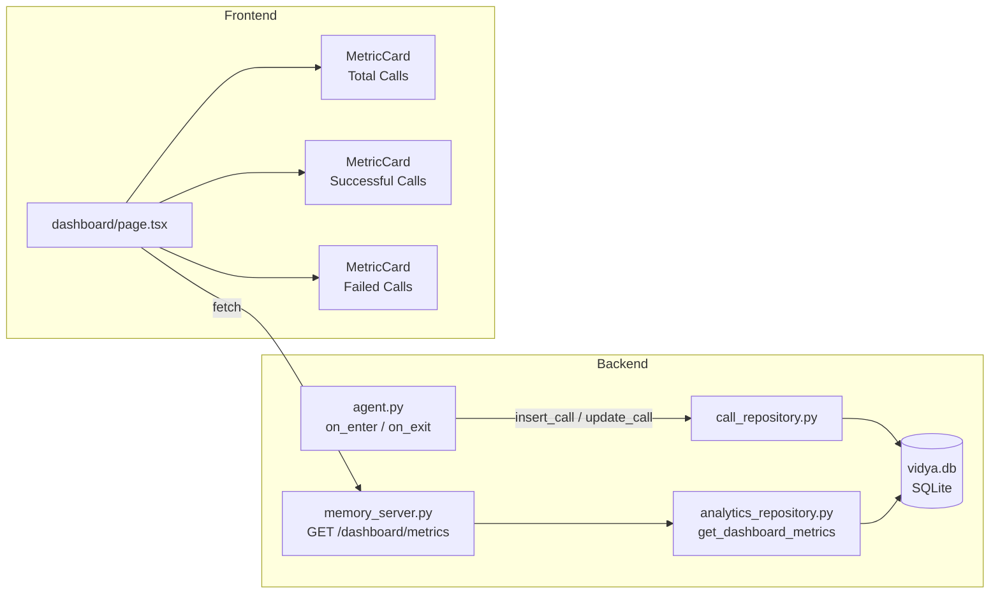

# Design Document — Call Analytics Dashboard (Day 8)

## Overview

Day 8 adds a read-only **Call Analytics Dashboard** to Vidya. The dashboard surfaces three aggregate metrics — **Total Calls**, **Successful Calls**, and **Failed Calls** — derived from data already stored in the existing `call_history` and `exercise_attempts` SQLite tables.

The feature is composed of four related pieces of work:

1. **Schema migration + outcome persistence** — a new `outcome` column on `call_history`, written at session end by the agent.
2. **Analytics Repository** — a new Python module (`analytics_repository.py`) that queries aggregate counts.
3. **Dashboard REST API** — a new `GET /dashboard/metrics` endpoint added to the existing `memory_server.py` handler.
4. **Dashboard UI Page** — a new Next.js page at `/dashboard` that fetches and renders the three Metric Cards.

These pieces are deliberately kept thin. The agent writes outcomes; the repository queries them; the API forwards them; the UI displays them. No new tables, no new services, no authentication — just a transparent analytics layer on top of existing data.

---

## Architecture



### Key design decisions

**Why add `outcome` at session end rather than computing it on-the-fly in the query?**
On-the-fly computation would require a correlated sub-query that joins `call_history` with `exercise_attempts` using a time-window overlap check. This is complex and adds a join to every dashboard fetch. Writing the outcome once at session end keeps the analytics query simple (`COUNT WHERE outcome = 'success'`) and makes the data self-contained — it survives even if `exercise_attempts` rows are later cleaned up.

**Why put `outcome` on `call_history` rather than a separate `call_outcomes` table?**
Keeping it as a nullable column on `call_history` avoids an extra table and foreign key. `NULL` naturally represents "not yet determined" (in-progress or pre-Day-8 calls), which maps cleanly onto the failing-calls definition (`outcome IS NULL OR outcome = 'failure'`).

**Why extend `memory_server.py` rather than creating a new server?**
The existing server already handles CORS, logging, `init_db()`, and the port binding. Adding a new route costs two dozen lines and zero operational overhead. A second server would require a new port, new CORS config, and a separate process.

**Why keep the Dashboard_Page purely client-side (a `'use client'` component)?**
The metrics data changes frequently (after each call) and doesn't need to be in the initial HTML for SEO. A client-side fetch with a Refresh button gives the simplest, most responsive experience without the complexity of server components or streaming.

---

## Components and Interfaces

### 1. `init_db()` — Schema Migration

**File:** `backend/src/db/database.py`

After the existing `ALTER TABLE` block for Day 6 user columns, add:

```python
import contextlib

with contextlib.suppress(sqlite3.OperationalError):
    conn.execute("ALTER TABLE call_history ADD COLUMN outcome TEXT")
```

`contextlib.suppress(sqlite3.OperationalError)` is already used in the same block for the Day 6 columns, so this follows the established pattern exactly.

### 2. `call_repository.update_call()` — Outcome Keyword

**File:** `backend/src/db/call_repository.py`

The existing `update_call` signature must gain an `outcome` parameter:

```python
def update_call(
    call_id: int,
    *,
    ended_at: str | None = None,
    duration_seconds: int | None = None,
    topic: str | None = None,
    performance: str | None = None,
    status: str | None = None,
    retry_attempted: int | None = None,
    outcome: str | None = None,   # ← new
) -> None:
```

`outcome` is included in the `fields` dict alongside the others, so the `{k: v for k, v in fields.items() if v is not None}` filter handles it automatically — no special-case logic required.

### 3. `Assistant` — Session Tracking and Outcome Persistence

**File:** `backend/src/agent.py`

**`__init__` change:**
```python
self._call_id: int | None = None
self._call_start_time: str | None = None   # ← new, always initialised
```

**`on_enter` addition (after greeting):**
```python
from datetime import datetime, timezone
started_at = datetime.now(timezone.utc).isoformat()
try:
    self._call_id = call_repository.insert_call(self._user_id, started_at)
    self._call_start_time = started_at
except Exception:
    logger.error("insert_call failed for user_id=%r — call tracking disabled", self._user_id)
    self._call_id = None
    self._call_start_time = None
```

**New `_compute_and_persist_outcome()` coroutine (called from `on_session_end` or equivalent):**

```python
async def _compute_and_persist_outcome(self) -> None:
    if self._is_outbound:
        outcome = "success"
    else:
        ended_at = datetime.now(timezone.utc).isoformat()
        has_attempt = await asyncio.to_thread(
            exercise_repository.has_attempt_in_window,
            self._user_id,
            self._call_start_time,
            ended_at,
        )
        outcome = "success" if has_attempt else "failure"

    if self._call_id is None:
        logger.warning(
            "call_id=None at session end for user_id=%r; computed outcome=%r",
            self._user_id,
            outcome,
        )
        return

    call_repository.update_call(self._call_id, outcome=outcome)
```

**New helper in `exercise_repository.py`:**

```python
def has_attempt_in_window(user_id: str, started_at: str | None, ended_at: str) -> bool:
    """Return True if >= 1 exercise_attempts row for user_id falls within [started_at, ended_at]."""
    if started_at is None:
        return False
    with get_connection() as conn:
        row = conn.execute(
            """
            SELECT 1 FROM exercise_attempts
            WHERE user_id = ?
              AND attempted_at >= ?
              AND attempted_at <= ?
            LIMIT 1
            """,
            (user_id, started_at, ended_at),
        ).fetchone()
    return row is not None
```

### 4. `analytics_repository.py` — New Module

**File:** `backend/src/db/analytics_repository.py`

```python
"""
Analytics Repository — aggregate queries for the Call Analytics Dashboard.

Provides:
  get_dashboard_metrics() -> dict  — returns total, successful, and failed call counts.
"""

from __future__ import annotations

try:
    from src.db.database import get_connection
except ImportError:
    from db.database import get_connection  # type: ignore[no-redef]


def get_dashboard_metrics() -> dict:
    """
    Return aggregate call metrics for the dashboard.

    Returns:
        {
            "total_calls": int,       # answered calls (any outcome)
            "successful_calls": int,  # answered + outcome = 'success'
            "failed_calls": int,      # answered + (outcome = 'failure' OR outcome IS NULL)
        }

    Invariant: successful_calls + failed_calls == total_calls

    Raises:
        sqlite3.Error: propagated uncaught if the database query fails.
    """
    with get_connection() as conn:
        row = conn.execute(
            """
            SELECT
                COUNT(*)                                                   AS total_calls,
                SUM(CASE WHEN outcome = 'success' THEN 1 ELSE 0 END)      AS successful_calls,
                SUM(CASE WHEN outcome = 'failure'
                          OR outcome IS NULL  THEN 1 ELSE 0 END)           AS failed_calls
            FROM call_history
            WHERE status = 'answered'
            """
        ).fetchone()

    return {
        "total_calls":      int(row["total_calls"]      or 0),
        "successful_calls": int(row["successful_calls"] or 0),
        "failed_calls":     int(row["failed_calls"]     or 0),
    }
```

**Design note:** A single `SELECT` with three `SUM(CASE …)` expressions is equivalent to three separate `COUNT` queries, but executes in a single table scan — important for SQLite which holds a write lock during reads.

### 5. `memory_server.py` — Dashboard Endpoint

**File:** `backend/src/api/memory_server.py`

**Import addition** (alongside the other try/except import blocks):

```python
try:
    from db.analytics_repository import get_dashboard_metrics
except ImportError:
    from src.db.analytics_repository import get_dashboard_metrics  # type: ignore[no-redef]
```

**Route in `do_GET`** (add before the `/memory/` route check):

```python
if self.path in ("/dashboard/metrics", "/dashboard/metrics/"):
    try:
        metrics = get_dashboard_metrics()
        self._send_json(200, metrics)
    except Exception:
        logger.exception("Error in GET /dashboard/metrics")
        self._send_json(500, {"error": "internal_error"})
    return
```

**`do_OPTIONS`** already calls `_send_cors_preflight()` unconditionally, so CORS preflight for `/dashboard/metrics` is handled with no additional code.

### 6. `frontend/app/dashboard/page.tsx` — Dashboard UI Page

The page is a Next.js App Router page. It exports a `Metadata` object (server-side) and renders a `'use client'` component for the interactive fetch logic.

**Structure:**

```
frontend/app/dashboard/
└── page.tsx        ← single file; metadata export + DashboardClient component
```

**Metadata export:**
```typescript
export const metadata: Metadata = {
  title: "Call Analytics | Vidya",
  description: "Aggregate call performance metrics for Vidya AI Learning Assistant",
};
```

**`DashboardClient` component responsibilities:**
- Holds `metrics`, `loading`, `error`, and `lastUpdated` state.
- On mount and on Refresh click, fires a new `fetch()` to `${baseUrl}/dashboard/metrics`.
- Uses `AbortController` to track in-flight requests. When a new fetch starts, the old controller is replaced (not aborted — this satisfies "first response wins" semantics rather than cancellation semantics). Both fetches remain in flight; whichever resolves first updates state.
- On success: sets `metrics`, clears `error`, updates `lastUpdated` timestamp.
- On failure: sets `error`, shows `—` placeholders, does not update `lastUpdated`.
- During loading: shows skeleton placeholder divs.

**Base URL resolution:**
```typescript
const BASE_URL =
  process.env.NEXT_PUBLIC_MEMORY_API_URL?.trim() || "http://localhost:8888";
```

**MetricCard sub-component:**
```typescript
interface MetricCardProps {
  label: string;
  value: number | null;  // null = loading/error
  accentVariant: "green" | "red" | "neutral";
}
```

Accent variant is determined by the parent:
- `successful_calls`: `value > 0 ? "green" : "neutral"`
- `failed_calls`: `value > 0 ? "red" : "neutral"`
- `total_calls`: always `"neutral"`

### 7. `frontend/.env.example` — New Entry

Add a new section to the existing `frontend/.env.example`:

```dotenv
# -----------------------------------------------------------------------------
# Backend memory / analytics API base URL
# Used by the Call Analytics Dashboard (Day 8) and other pages that query
# the backend REST API (memory, calls, escalations).
# Default: http://localhost:8888 — no need to set this for local development.
# -----------------------------------------------------------------------------
# NEXT_PUBLIC_MEMORY_API_URL=http://localhost:8888
```

---

## Data Models

### `call_history` Table (updated)

| Column | Type | Notes |
|---|---|---|
| `id` | INTEGER PK | Autoincrement |
| `user_id` | TEXT NOT NULL | FK → users |
| `started_at` | TEXT NOT NULL | UTC ISO 8601 |
| `ended_at` | TEXT | UTC ISO 8601, nullable |
| `duration_seconds` | INTEGER | nullable |
| `topic` | TEXT | nullable |
| `performance` | TEXT | nullable |
| `status` | TEXT NOT NULL | `'answered'` or `'missed'` |
| `retry_of` | INTEGER | nullable |
| `retry_attempted` | INTEGER DEFAULT 0 | |
| **`outcome`** | **TEXT** | **New. `'success'`, `'failure'`, or `NULL`** |

### `exercise_attempts` Table (unchanged)

| Column | Type | Notes |
|---|---|---|
| `id` | INTEGER PK | |
| `user_id` | TEXT NOT NULL | |
| `exercise_id` | TEXT NOT NULL | |
| `topic` | TEXT NOT NULL | |
| `result` | TEXT NOT NULL | `'correct'`, `'incorrect'`, `'partially_correct'` |
| `attempted_at` | TEXT NOT NULL | UTC ISO 8601 |

### Dashboard Metrics Response Shape

```typescript
interface DashboardMetrics {
  total_calls: number;
  successful_calls: number;
  failed_calls: number;
}
```

### Frontend State Shape

```typescript
type FetchStatus = "idle" | "loading" | "success" | "error";

interface DashboardState {
  metrics: DashboardMetrics | null;
  status: FetchStatus;
  lastUpdated: Date | null;
  error: string | null;
}
```

---

## Correctness Properties

*A property is a characteristic or behavior that should hold true across all valid executions of a system — essentially, a formal statement about what the system should do. Properties serve as the bridge between human-readable specifications and machine-verifiable correctness guarantees.*

### Property 1: `init_db()` Idempotency for `outcome` Column

*For any* fresh SQLite database, calling `init_db()` two or more times in succession SHALL NOT raise an exception, and the `outcome` column SHALL be present in `call_history` after every invocation.

**Validates: Requirements 1.1, 8.8**

---

### Property 2: Inbound Outcome Computation Correctness

*For any* `user_id`, `call_start_time`, and finite set of `exercise_attempts` timestamps, the computed outcome SHALL be `'success'` if and only if at least one `attempted_at` timestamp falls within the half-open interval `[call_start_time, now]`; otherwise the outcome SHALL be `'failure'`.

**Validates: Requirements 1.2, 1.5**

---

### Property 3: Outbound Calls Always Yield `'success'`

*For any* outbound session (regardless of `user_id`, call window, or exercise attempt history), the computed outcome SHALL always be `'success'`.

**Validates: Requirements 1.6**

---

### Property 4: `update_call` Persists Outcome

*For any* non-`None` outcome string `s`, calling `update_call(call_id, outcome=s)` on an existing `call_history` row and then reading that row back from the database SHALL yield `outcome == s`.

**Validates: Requirements 1.3, 1.4**

---

### Property 5: Dashboard Metrics Invariant and Key Contract

*For any* state of the `call_history` table (including empty, all-answered, mixed statuses, and mixed outcomes), `get_dashboard_metrics()` SHALL:
1. Return a dict containing **exactly** the three keys `total_calls`, `successful_calls`, `failed_calls` — no more, no fewer.
2. Satisfy `successful_calls + failed_calls == total_calls`.
3. Return non-negative integers for all three values.

**Validates: Requirements 2.2, 2.3, 2.4, 2.5, 6.1, 6.3**

---

### Property 6: Dashboard API Response Contains No Personal Data

*For any* state of the `call_history` table, the JSON body returned by `GET /dashboard/metrics` SHALL contain exactly the three keys `total_calls`, `successful_calls`, `failed_calls` and SHALL NOT contain any of the strings `user_id`, `name`, `sip_uri`, `preferred_time`, `topic`, `performance`, `status` (row-level), or any field from the `users` table.

**Validates: Requirements 3.1, 3.4, 6.1, 6.2**

---

### Property 7: Metric Card Color Logic

*For any* `(successful_calls, failed_calls)` pair of non-negative integers:
- The "Successful Calls" card SHALL use the green accent when `successful_calls > 0`, and the neutral accent when `successful_calls == 0` or data is unavailable.
- The "Failed Calls" card SHALL use the red accent when `failed_calls > 0`, and the neutral accent when `failed_calls == 0` or data is unavailable.
- The "Total Calls" card SHALL always use the neutral accent.

**Validates: Requirements 4.7**

---

### Property 8: Last-Updated Timestamp Only Advances on Successful Fetch

*For any* sequence of fetch outcomes (success, error, or still-loading), the `lastUpdated` timestamp SHALL be updated if and only if the fetch completed successfully. An error response or an in-progress fetch SHALL NOT change the timestamp.

**Validates: Requirements 4.9**

---

### Property 9: Base URL Resolution from Environment Variable

*For any* value of `NEXT_PUBLIC_MEMORY_API_URL`:
- When the value is `undefined`, `null`, or a string composed entirely of whitespace, the constructed API URL SHALL begin with `http://localhost:8888`.
- When the value is a non-empty string beginning with `http://` or `https://`, the constructed API URL SHALL begin with that value.

**Validates: Requirements 5.2, 5.3**

---

## Error Handling

| Failure Scenario | Component | Handling Strategy |
|---|---|---|
| `insert_call` throws at session start | `agent.py` | Log at ERROR, set `_call_id = None` and `_call_start_time = None`, continue session |
| `update_call` throws at session end | `agent.py` | Log at ERROR, swallow exception — outcome data is advisory, not critical |
| `_call_id is None` at session end | `agent.py` | Log WARNING with `call_id=None` and computed outcome string; do not raise |
| `get_dashboard_metrics()` DB error | `analytics_repository.py` | Propagate exception uncaught (no silent zeroes) |
| DB exception in `GET /dashboard/metrics` handler | `memory_server.py` | Catch, `logger.exception(...)`, return HTTP 500 `{"error": "internal_error"}` |
| Network error / non-200 on frontend fetch | `DashboardClient` | Set error state, show `—` placeholders, do not update `lastUpdated` |
| `NEXT_PUBLIC_MEMORY_API_URL` missing or empty | `DashboardClient` | Silently fall back to `http://localhost:8888` at the URL construction step |
| `outcome` column already exists on `init_db()` | `database.py` | `contextlib.suppress(sqlite3.OperationalError)` swallows the duplicate-column error |

---

## Testing Strategy

### Backend — Python (pytest + Hypothesis)

**Unit tests (example-based)** — `backend/tests/test_analytics_repository.py`:
- Empty `call_history` → all zeros.
- Mix of `answered`/`missed` calls → only answered rows counted.
- `outcome = 'success'` rows → counted in `successful_calls`.
- `outcome = 'failure'` rows → counted in `failed_calls`.
- `outcome IS NULL` rows → counted in `failed_calls`.
- DB error propagates (monkeypatch `get_connection` to raise).
- `update_call(call_id, outcome='success')` persists value.
- `update_call(call_id, outcome='failure')` persists value.
- `_call_id is None` at session end → warning logged, no exception.
- `on_enter` inserts a call row with status `'answered'`.

**Property-based tests (Hypothesis)** — `backend/tests/test_analytics_repository.py`:

Each test runs a **minimum of 100 iterations**.

```
# Feature: vidya-day8-dashboard, Property 1: init_db idempotency
# Feature: vidya-day8-dashboard, Property 2: Inbound outcome computation correctness
# Feature: vidya-day8-dashboard, Property 3: Outbound calls always yield 'success'
# Feature: vidya-day8-dashboard, Property 4: update_call persists outcome
# Feature: vidya-day8-dashboard, Property 5: Dashboard metrics invariant and key contract
# Feature: vidya-day8-dashboard, Property 6: Dashboard API response contains no personal data
```

Property 1 uses `st.integers(min_value=2, max_value=5)` to call `init_db()` N times.

Property 2 uses a composite strategy generating random UTC datetimes for `call_start`, a random set of `attempted_at` timestamps (some inside, some outside the window), and verifies the outcome.

Property 3 uses `st.text()` for `user_id` and `st.lists(...)` of attempt timestamps.

Property 4 uses `st.sampled_from(['success', 'failure'])` and arbitrary `st.text()` for outcome strings.

Property 5 uses a composite strategy that builds a random list of call records with varying `status` (`'answered'`, `'missed'`) and `outcome` (`'success'`, `'failure'`, `None`) values, inserts them, calls `get_dashboard_metrics()`, and asserts all three invariants simultaneously.

Property 6 is a superset of Property 5 — for any call history state, parse the `GET /dashboard/metrics` response JSON and assert the key set is exactly `{'total_calls', 'successful_calls', 'failed_calls'}`.

**Integration smoke tests:**
- `ruff check .` — zero errors (run in CI).
- `uv run pytest` — all collected tests pass.

All backend property tests use an isolated temp SQLite database via the `isolated_db` fixture pattern established in `test_call_repository.py` and `test_memory.py`.

### Frontend — TypeScript (Jest / Vitest + React Testing Library)

**Unit tests (example-based):**
- `MetricCard` renders label and value.
- `MetricCard` applies green class when `accentVariant='green'`.
- `MetricCard` applies red class when `accentVariant='red'`.
- `MetricCard` renders `—` when `value` is `null`.
- `DashboardClient` shows loading state on initial render.
- `DashboardClient` shows metric values after successful fetch.
- `DashboardClient` shows error state and `—` after failed fetch.
- `DashboardClient` does not update `lastUpdated` after failed fetch.
- `DashboardClient` updates `lastUpdated` only after successful fetch.
- Refresh button triggers a new fetch call.
- `metadata.title` equals `"Call Analytics | Vidya"`.

**Build verification:**
- `pnpm build` completes with exit code 0 and zero TypeScript errors (run in CI).

### Regression Gate

Before merging Day 8:
1. `uv run ruff check .` in `backend/` — exit 0.
2. `uv run pytest` in `backend/` — all tests pass (including existing Day 1–7 suites).
3. `pnpm build` in `frontend/` — exit 0, no TypeScript errors.
