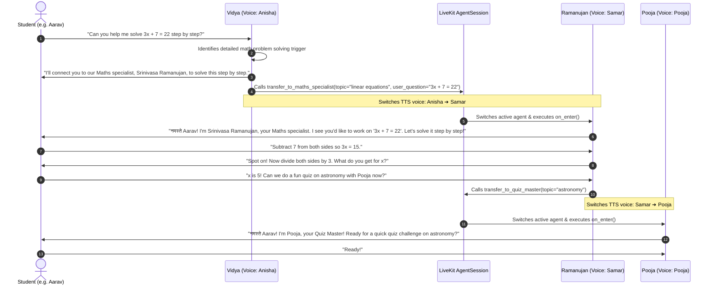

# Day 9 — Multi-Agent Multi-Persona Handoff (Anisha, Samar, Pooja)

This document describes the design, architecture, persona division, Socratic pedagogy, context preservation, and test suite for the **Multi-Agent Multi-Persona Handoff** system implemented in the **Vidya** AI voice assistant for Indian students.

---

## 1. Overview & Persona Voice Mapping

In voice learning, different educational scenarios benefit from distinct tutor personalities and voice characteristics:

| Persona Name | Personality & Pedagogical Role | Murf Falcon Voice | Style | Key Responsibilities |
|---|---|---|---|---|
| **Vidya** | Warm, encouraging, nurturing primary tutor | **`Anisha`** | `Conversation` | Concept explanations, revision, curriculum navigation, learner memory, human escalation |
| **Srinivasa Ramanujan** | Analytical, enthusiastic, methodical mentor | **`Samar`** | `Conversation` | In-depth Socratic step-by-step problem solving for algebra, arithmetic, fractions, equations |
| **Pooja** | Energetic, vibrant, playful quizmaster | **`Pooja`** | `Conversation` | Interactive practice quizzes, fast-paced challenge questions, science exploration |

### Key Objectives
1. **Clear Division of Roles & Voices**: Each agent is initialized with its own dedicated Murf Falcon TTS streaming instance (`tts=murf.TTS(voice=...)`), dynamically switching voices during handoff.
2. **Framework-Level Agent Handoff**: Using LiveKit Agents SDK (`livekit-agents ~1.4`), returning an `Agent` instance from a `@function_tool` to transfer voice session control seamlessly.
3. **Smooth Audio Handoff UX**:
   - Main agent verbally announces the transfer before switching.
   - Specialist agent introduces itself and immediately references the forwarded problem/topic upon `on_enter`.
4. **Context Preservation**: Forwarding learner identity (`user_id`, `student_name`, `grade_level`, `topic`/`initial_query`) across agents without asking the student to repeat themselves.
5. **Bidirectional & Cross-Specialist Routing**: Allowing specialists to return the session to Vidya or hand off directly to another specialist (e.g. Ramanujan ↔ Pooja).

---

## 2. Architecture & Data Flow



---

## 3. Implementation Details

### 3.1. Voice Setup in `backend/src/agent.py`

```python
VOICE_VIDYA = "Anisha"
VOICE_MATHS_SPECIALIST = "Samar"
VOICE_QUIZ_MASTER = "Pooja"

class Assistant(Agent):
    def __init__(self, ..., tts: murf.TTS | None = None):
        agent_tts = tts or create_murf_tts(VOICE_VIDYA)
        super().__init__(instructions=SYSTEM_PROMPT, tts=agent_tts)

class MathsSpecialistAssistant(Agent):
    def __init__(self, ..., tts: murf.TTS | None = None):
        agent_tts = tts or create_murf_tts(VOICE_MATHS_SPECIALIST)
        super().__init__(instructions=MATHS_SPECIALIST_PROMPT, tts=agent_tts)

class QuizMasterAssistant(Agent):
    def __init__(self, ..., tts: murf.TTS | None = None):
        agent_tts = tts or create_murf_tts(VOICE_QUIZ_MASTER)
        super().__init__(instructions=QUIZ_MASTER_PROMPT, tts=agent_tts)
```

---

## 4. Testing & Verification

The test suite is located in `backend/tests/test_handoff.py`:

| Test Name | Verification Objective |
|---|---|
| `test_persona_voices_configuration` | Confirms Anisha, Samar, and Pooja voice constants. |
| `test_normal_query_stays_with_vidya` | Science / General queries remain with Vidya without triggering a handoff. |
| `test_math_query_triggers_handoff` | Algebra / Equation queries invoke `transfer_to_maths_specialist` (Samar). |
| `test_quiz_query_triggers_handoff` | Quiz queries invoke `transfer_to_quiz_master` (Pooja). |
| `test_math_specialist_initialization_context` | Learner name, grade, and query are preserved for Ramanujan. |
| `test_quiz_master_initialization_context` | Learner name, grade, and topic are preserved for Pooja. |
| `test_specialist_socratic_guidance` | Ramanujan guides students step-by-step rather than giving immediate answers. |
| `test_specialist_hand_back_tool` | `hand_back_to_vidya` returns an `Assistant` instance with preserved state. |
| `test_quiz_master_hand_back_tool` | `hand_back_to_vidya` returns an `Assistant` instance from Quiz Master. |
| `test_cross_specialist_handoff` | Ramanujan ↔ Pooja cross-specialist handoff operates seamlessly. |

Run tests with:
```bash
cd backend
uv run pytest tests/test_handoff.py -v
```

