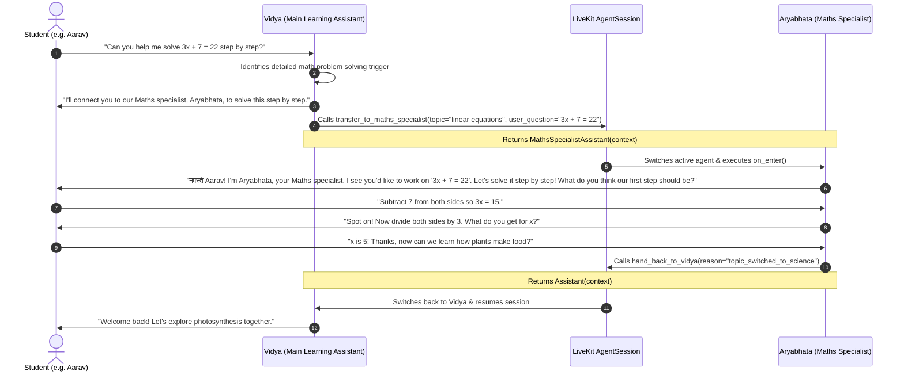

# Day 9 — Multi-Agent Handoff (Maths Practice Specialist)

This document describes the design, architecture, Socratic pedagogy, context preservation, and test suite for the **Multi-Agent Handoff** system implemented in the **Vidya** AI voice assistant for Indian students.

---

## 1. Overview & Objectives

In voice learning, a generalist assistant should not attempt to be an expert in everything. While **Vidya** handles broad learning topics (Science, English, revision, quizzes, and curriculum guidance), mathematical problem-solving requires a dedicated pedagogical strategy: **step-by-step Socratic guidance without giving away answers directly**.

For Day 9, we introduce **Aryabhata**, a specialized **Maths Practice Specialist Agent**, and integrate a bidirectional handoff between Vidya and Aryabhata.

### Key Objectives
1. **Clear Division of Roles**:
   - **Vidya (Main Agent)**: Concepts, general science, english grammar, revision, quizzes, and learner memory.
   - **Aryabhata (Maths Specialist)**: In-depth, step-by-step mathematical problem solving (algebra, arithmetic, linear equations, fractions, trigonometry, geometry) using Socratic guidance.
2. **Framework-Level Agent Handoff**: Using LiveKit Agents SDK (`livekit-agents ~1.4`), returning an `Agent` instance from a `@function_tool` to transfer voice session control.
3. **Smooth Audio Handoff UX**:
   - Main agent verbally announces the transfer before switching.
   - Specialist agent introduces itself and immediately references the forwarded problem upon `on_enter`.
4. **Context Preservation**: Forwarding learner identity (`user_id`, `student_name`, `grade_level`, `initial_query`) across agents without asking the student to repeat themselves.
5. **Bidirectional Routing (Hand Back)**: Allowing the specialist to return the session to Vidya when the math task is complete or the user switches topics.

---

## 2. Architecture & Data Flow



---

## 3. Implementation Details

### 3.1. Main Agent Handoff Tool (`transfer_to_maths_specialist`)
Located in `backend/src/agent.py` inside class `Assistant`:

```python
@function_tool
async def transfer_to_maths_specialist(
    self,
    topic: str,
    user_question: str = "",
) -> Agent:
    """
    Hand off the conversation to Aryabhata, the dedicated Maths Practice Specialist.
    Call this tool ONLY when the learner asks for step-by-step math problem solving,
    equations, algebra, arithmetic, or dedicated mathematics practice.
    """
    await self._emit_tool_event(
        "agent_handoff",
        {
            "from": "Vidya",
            "to": "Aryabhata (Maths Specialist)",
            "topic": topic,
            "user_question": user_question,
        },
    )
    try:
        await self.session.say(
            "I'll connect you to our Maths specialist, Aryabhata, to solve this step by step."
        )
    except RuntimeError:
        pass
    return MathsSpecialistAssistant(
        user_id=self._user_id,
        student_name=self._detected_name,
        grade_level=self._detected_class,
        initial_query=user_question or topic,
        room=self._room,
    )
```

### 3.2. Maths Specialist Agent (`MathsSpecialistAssistant`)
Located in `backend/src/agent.py`:

```python
class MathsSpecialistAssistant(Agent):
    def __init__(
        self,
        user_id: str = "anonymous",
        student_name: str | None = None,
        grade_level: str | None = None,
        initial_query: str = "",
        room: rtc.Room | None = None,
    ) -> None:
        super().__init__(instructions=MATHS_SPECIALIST_PROMPT)
        self._user_id = user_id
        self._student_name = student_name
        self._grade_level = grade_level
        self._initial_query = initial_query
        self._room = room

    async def on_enter(self) -> None:
        """Introduce Aryabhata and acknowledge the forwarded math problem."""
        greeting = f"नमस्ते {self._student_name}!" if self._student_name else "नमस्ते!"
        greeting += " I'm Aryabhata, your Maths specialist."
        if self._initial_query:
            greeting += f" I see you'd like to work on '{self._initial_query}'. Let's solve it step by step! What do you think our first step should be?"
        else:
            greeting += " What math problem or concept would you like to practice today?"
        await self.session.say(greeting)

    @function_tool
    async def hand_back_to_vidya(self, reason: str = "topic_completed") -> Agent:
        """Hand the conversation back to Vidya, the main learning assistant."""
        await self._emit_tool_event(
            "agent_handoff",
            {"from": "Aryabhata (Maths Specialist)", "to": "Vidya", "reason": reason},
        )
        try:
            await self.session.say("I'll connect you back to Vidya now.")
        except RuntimeError:
            pass
        return Assistant(user_id=self._user_id, room=self._room)
```

---

## 4. Testing & Verification

The test suite is located in `backend/tests/test_handoff.py`:

| Test Name | Verification Objective |
|---|---|
| `test_normal_query_stays_with_vidya` | Science / General queries remain with Vidya without triggering a handoff. |
| `test_math_query_triggers_handoff` | Algebra / Equation queries invoke `transfer_to_maths_specialist`. |
| `test_specialist_initialization_context` | Learner name, grade, and initial query are preserved across agents. |
| `test_specialist_socratic_guidance` | Aryabhata guides students step-by-step rather than giving immediate answers. |
| `test_specialist_hand_back_tool` | `hand_back_to_vidya` returns an `Assistant` instance with preserved state. |

Run tests with:
```bash
cd backend
uv run pytest tests/test_handoff.py -v
```
